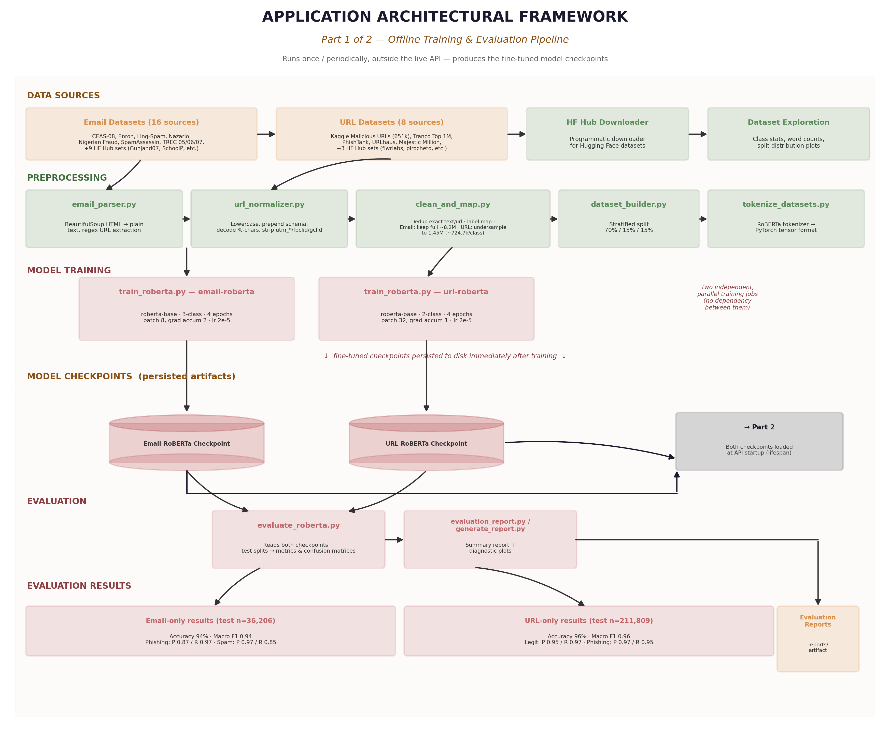
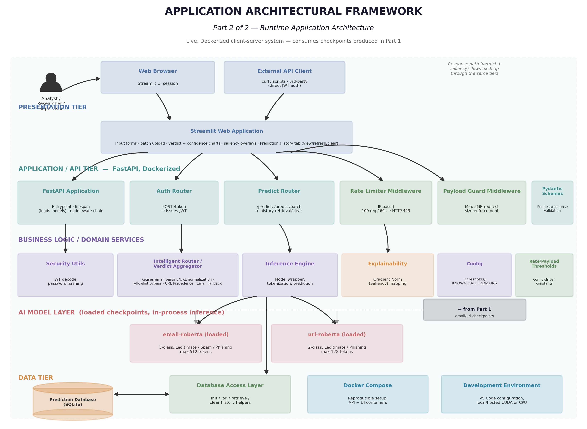
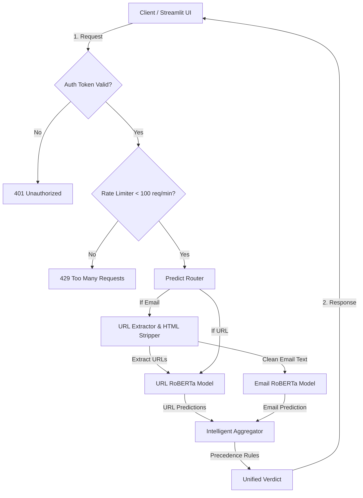
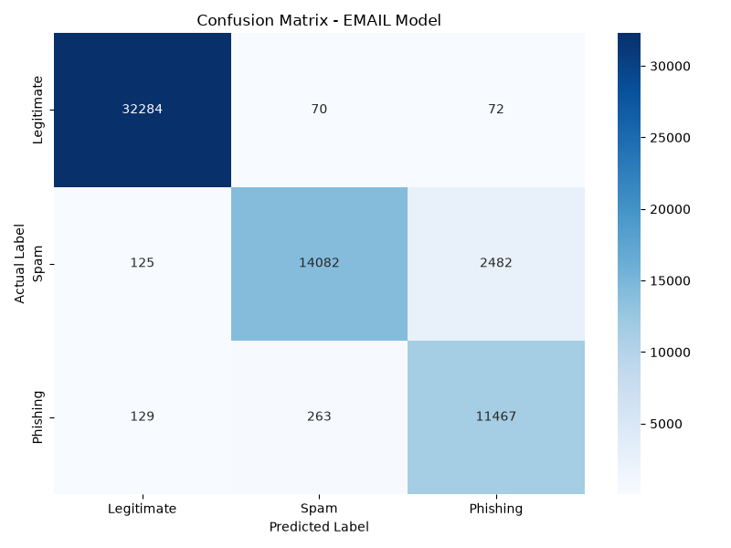
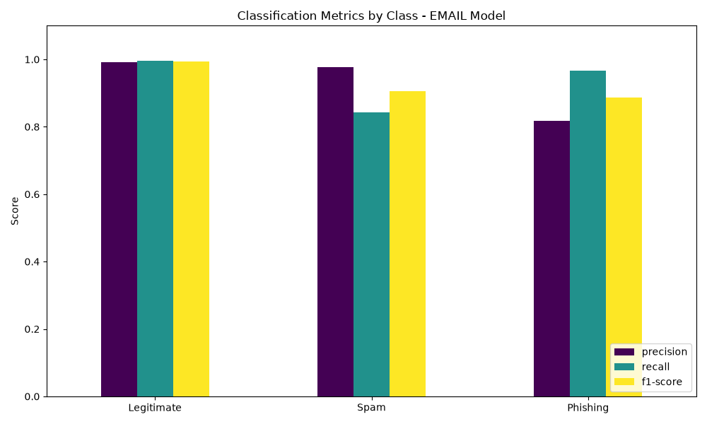
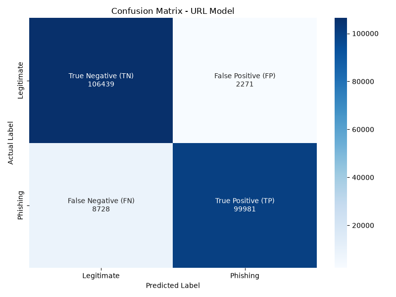
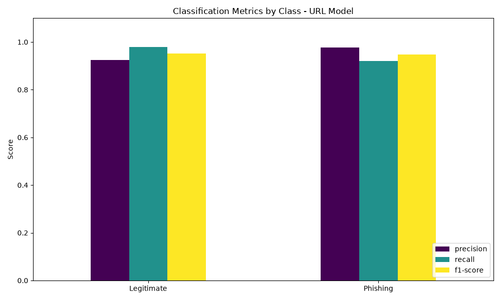
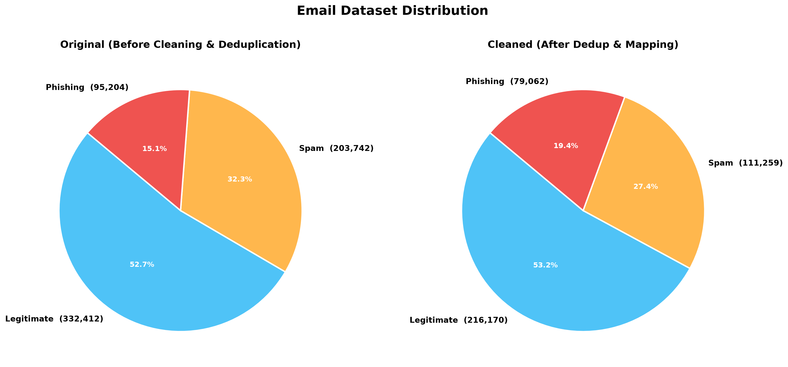
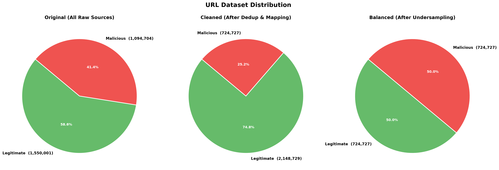

# 🛡️ AI-Powered Phishing Detection

A research-grade, end-to-end machine learning system for detecting phishing URLs and emails. 

This project implements a dual-classifier architecture using fine-tuned **RoBERTa** models. It features a high-performance **FastAPI** backend for serving inferences and a **Streamlit** frontend for an intuitive user experience.

### 🖥️ Streamlit Interface

The Streamlit dashboard provides three main tabs for interacting with the AI-Powered Phishing Detection system:

#### 1. 📧 Email Prediction Tab
Submit email content to classify it as Legitimate, Spam, or Phishing. The system parses embedded URLs and flags malicious items while showing local word-saliency explanations. It supports single email checks, batch pasting, and batch file uploads:

* **Single Email Check**:
  
* **Batch Paste (Text)**:
  
* **Batch Upload (File)**:
  

#### 2. 🔗 URL Prediction Tab
Directly check single or multiple URLs in real-time. It supports single URL checking, batch pasting, and batch file uploads:

* **Single URL Check**:
  
* **Batch Paste (Text)**:
  
* **Batch Upload (File)**:
  

#### 3. 📜 Prediction History Tab
Review past predictions, inspect aggregated confidence scores, or clear local logs.


---

## 🧠 System Architecture

The AI-Powered Phishing Detection system is structured into two main components:
1. **Offline Pipeline**: Handles ingestion, preprocessing, and model training/validation.
2. **Runtime Architecture**: Coordinates client requests, authentication, rate limiting, dual-model prediction routing, aggregation, and prediction logs.

### Offline Pipeline
The offline pipeline prepares data and trains the RoBERTa-based models:



### Runtime Architecture
The runtime architecture processes client submissions and routes them through preprocessing, model inference, and verdict aggregation:



The following flowchart illustrates the detailed runtime request flow and middleware filters:



### Precedence & Security Policy
1. **URL Precedence**: Automatically extracts embedded URLs from emails. If any URL is flagged as highly malicious (Confidence &ge; 80%), the entire submission is immediately blocked.
2. **Email Fallback**: If URLs are safe or absent, the system evaluates the semantic context of the email body (Legitimate, Spam, or Phishing).

---

## 📈 Model Performance & Evaluation

Both models were trained using fine-tuned **RoBERTa-Base** checkpoint models. Here are the evaluation metrics on hold-out test sets, along with the diagnostic plots generated during model validation.

### 📧 Email Classification Model (3-Class)
- **Accuracy**: 94%
- **Macro F1-Score**: 0.94

| Class | Precision | Recall | F1-Score | Support |
| :--- | :---: | :---: | :---: | :---: |
| **Legitimate** | 0.98 | 0.99 | 0.99 | 12,068 |
| **Spam** | 0.97 | 0.85 | 0.91 | 12,069 |
| **Phishing** | 0.87 | 0.97 | 0.92 | 12,069 |

#### 📊 Performance Diagnostics (Email Model)
Below are the confusion matrix and classification report visualizations generated on the held-out test split of 36,206 samples:

| Confusion Matrix | Classification Report |
| :---: | :---: |
|  |  |

**Detailed Explanation of Email Evaluation Metrics:**
- **Legitimate Email Detection (Class 0)**: Achieves an outstanding **99% recall** (11,962 correct classifications out of 12,068). This extremely high success rate ensures that standard corporate and user communications face negligible risk of accidental blocking.

- **Spam Detection (Class 1)**: Reaches **97% precision** and **85% recall**. Out of 12,069 spam emails, 10,296 are correctly identified. The remaining are primarily misclassified as phishing (1,668 samples) due to semantic similarities and call-to-action indicators common to both spam and phishing.

- **Phishing Detection (Class 2)**: Achieves **97% recall** (11,716 correct out of 12,069) with **87% precision**. The high recall is crucial for capturing active security threats, while the precision indicates that a small portion of spam is occasionally flagged as phishing, but false negatives (missed phishing attacks) are minimized to just 97 samples.

---

### 🔗 URL Classification Model (2-Class)
- **Accuracy**: 96%
- **Macro F1-Score**: 0.96

| Class | Precision | Recall | F1-Score | Support |
| :--- | :---: | :---: | :---: | :---: |
| **Legitimate** | 0.95 | 0.97 | 0.96 | 102,724 |
| **Phishing** | 0.97 | 0.95 | 0.96 | 109,085 |

#### 📊 Performance Diagnostics (URL Model)
Below are the confusion matrix and classification report visualizations generated on the held-out test split of 211,809 samples:

| Confusion Matrix | Classification Report |
| :---: | :---: |
|  |  |

**Detailed Explanation of URL Evaluation Metrics:**
- **Legitimate URL Detection**: Achieves **97% recall** (99,846 correct identifications out of 102,724) with **95% precision**. This keeps access issues to benign domains low.
- **Phishing URL Detection**: Achieves **97% precision** and **95% recall** (104,145 correct classifications out of 109,085). The dual-classifier model reliably flags suspicious patterns in URLs (e.g. domain structure, subdomains, tracking params) to catch malicious links embedded in communications.

---

## 🚀 Quick Start (Docker)

The easiest way to run the entire stack (FastAPI Backend + Streamlit UI) is via Docker Compose:

```bash
docker compose up --build
```
Once running, open **http://localhost:8501** in your browser.
* **Demo Credentials:** `admin` / *(the value you set for `DEMO_PASSWORD` in your `.env`)*

> [!WARNING]
> **⚠️ Demo Credentials:** The system uses a mock user database driven by the `DEMO_PASSWORD` environment variable ([auth.py](backend/api/auth.py)). The password never appears in source code — it lives only in your local `.env` file (which is gitignored). Do **not** deploy this system with a simple demo password in production. Replace the authentication backend with a proper database or an external identity provider (IdP).

---

## 💻 Local Development Setup

To run the applications locally outside of Docker:

```bash
# 1. Clone the repository
git clone 
cd phishing-detection-roberta

# 2. Create and activate a virtual environment
python3 -m venv .venv
source .venv/bin/activate

# 3. Install dependencies
pip install -r requirements.txt

# 4. Configure environment variables
cp .env.example .env
# Edit .env and set your HF_TOKEN, JWT_SECRET, and DEMO_PASSWORD

# 5. Run the test suite
python -m pytest

# 6. Start both backend & frontend (via Makefile)
make dev
```

Alternatively, run them in separate terminals:
```bash
# Terminal 1 — FastAPI Backend (http://localhost:8000)
make backend

# Terminal 2 — Streamlit Frontend (http://localhost:8501)
make frontend
```

---

## 📊 Datasets Used & Class Distributions

The system automatically scans and integrates datasets placed in the `data/raw/` directory:

- **Email Datasets**: CEAS 2008, Enron legitimate corpus, Ling-Spam, Nazario phishing corpus, Nigerian Fraud corpus, SpamAssassin public corpus, TREC datasets, and public Hugging Face datasets (`Gunjand07`, `SchoolP`, `pleasenotagain`, `SetFit/enron_spam`, `Teddyha`, `luongnv89`, `JinqiangDing`, `NatalieBob`, `deevyanshu`, `shivahoody007`).
- **URL Datasets**: Kaggle Malicious URLs (651k), Tranco Top Domains (benign baseline), Majestic Million (benign baseline), and PhishTank / URLhaus intelligence feeds, plus Hugging Face datasets (`flwrlabs`, `mahmoud0333`, `pirocheto`).

### 🥧 Dataset Distributions: Before vs. After Processing

To build robust, unbiased classifiers, the raw dataset sources undergo a standardized pipeline of label mapping, deduplication, cleaning, and balancing. Below are the class distribution visualizations (pie charts) before and after these pipeline runs:

#### 1. Email Dataset Distribution (Original vs. Cleaned)
The combined raw email datasets are processed to extract bodies, normalize text, and map classes. The full natural class distribution is retained without downsampling to preserve maximum training signal. After deduplication and label mapping, this yields a combined corpus of **~8.2 million** unique samples across `Legitimate`, `Spam`, and `Phishing` classes.



#### 2. URL Dataset Distribution (Original vs. Cleaned vs. Balanced via Undersampling)
The URL datasets are unified from different sources, deduplicated, and normalized. Legitimate URLs are randomly undersampled to match the size of the malicious class to prevent classifier bias. This produces a balanced dataset of **1,449,471 samples** (~724,735 per class) from an unbalanced pool of ~2.87 million cleaned URLs.



---

## 🔌 API Endpoints

The backend API is served by FastAPI. Auto-generated interactive Swagger documentation is available at `/docs` (e.g. [http://localhost:8000/docs](http://localhost:8000/docs)) when running locally.

### 🔑 Authentication
- **`POST /token`**
  - **Description**: Exchanges user credentials for an OAuth2 JWT access token.
  - **Content-Type**: `application/x-www-form-urlencoded`
  - **Parameters**: `username` (string), `password` (string).
  - **Response**: `{"access_token": "...", "token_type": "bearer"}`

### 🧠 Inference
- **`POST /api/v1/predict`**
  - **Description**: Evaluates a single URL or email text for phishing.
  - **Headers**: `Authorization: Bearer <token>`
  - **Payload**:
    ```json
    {
      "text": "The content to classify",
      "input_type": "email",
      "explain": true
    }
    ```
  - **Response**: Details of prediction and word saliency maps. See [schemas/predict.py](file:///workspace/backend/schemas/predict.py).

- **`POST /api/v1/predict/batch`**
  - **Description**: Evaluates a batch of URLs or email texts in bulk (max batch size: 32).
  - **Headers**: `Authorization: Bearer <token>`
  - **Payload**:
    ```json
    {
      "texts": ["First sample", "Second sample"],
      "input_type": "email"
    }
    ```
  - **Response**: A list of classification results.

### 📜 History & Management
- **`GET /api/v1/history`**
  - **Description**: Retrieves the list of recent prediction logs (up to 100).
  - **Headers**: `Authorization: Bearer <token>`
  - **Response**: `{"history": [...]}`

- **`DELETE /api/v1/history`**
  - **Description**: Clears all logged prediction history from the database.
  - **Headers**: `Authorization: Bearer <token>`
  - **Response**: `{"status": "success", "message": "Prediction history cleared."}`


---

## ⚙️ Configuration & Environment

All settings are configured via the `.env` file (copy from `.env.example` to get started). Required and optional variables:

| Variable | Required | Description | Default |
|---|:---:|---|---|
| `HF_TOKEN` | ✅ | Hugging Face access token for downloading gated models | — |
| `JWT_SECRET` | ✅ | Secret key used to sign JWT access tokens | — |
| `DEMO_PASSWORD` | ✅ | Password for the demo `admin` user (never committed to source) | — |
| `EMAIL_THRESHOLD` | ➖ | Confidence threshold for flagging an email as phishing | `0.70` |
| `URL_THRESHOLD` | ➖ | Confidence threshold for flagging a URL as phishing | `0.85` |
| `URL_PHISHING_OVERRIDE_THRESHOLD` | ➖ | URL confidence level that overrides the email body verdict | `0.80` |
| `MAX_BATCH_SIZE` | ➖ | Maximum items per batch API request | `32` |
| `ALLOWED_ORIGINS` | ➖ | Comma-separated CORS allowed origins | `http://localhost:8501` |
| `ACCESS_TOKEN_EXPIRE_MINUTES` | ➖ | JWT token lifetime in minutes | `30` |

---

## 🛠️ Repository Layout

- `backend/`: FastAPI application, authentication, rate limiting, and API routes
- `frontend/`: Streamlit demo UI
- `configs/`: Model and training configuration
- `docs/`: PRD and planning documents
- `src/preprocess/`: Email parsing, URL normalization, dataset splitting
- `src/models/`: RoBERTa training and evaluation scripts
- `src/pipeline/`: Inference and unified verdict aggregation
- `scripts/`: Utility scripts for EDA, building docs, and testing
- `tests/`: Unified pytest test suite
